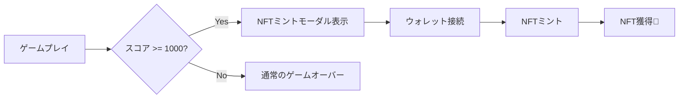

# Tetris - Farcaster Mini App (NFT報酬機能付き)

## 🎮 + 🎨 = 🏆

Classic Tetris game as a Farcaster Mini App **with NFT reward system**.

## ✨ 新機能: NFT報酬システム

### 実装済み機能
- ✅ **ハイスコアNFT**: 1000点以上でNFTミント可能
- ✅ **ウォレット連携**: Coinbase Wallet統合
- ✅ **スコア記録**: NFTにスコアが記録される
- ✅ **ユーザー追跡**: ベストスコアの保存
- ✅ **セキュア**: 再入攻撃対策、一時停止機能

### NFTの特典
- 🏆 **Score**: あなたのスコアが記録
- 🎖️ **Achievement**: Champion / Expert / Master
- 📅 **Date**: 達成日時が記録
- 🔒 **Ownership**: あなただけの証明NFT

## 📦 NFT実装ファイル

プロジェクトに以下が追加されています：

### スマートコントラクト
- `contracts/TetrisNFT.sol` - ERC721 NFTコントラクト (3.4KB)
- `contracts/deploy.ts` - デプロイスクリプト
- `utils/abis/TetrisNFT.ts` - コントラクトABI

### フロントエンド
- `app/providers.tsx` - Wagmi設定
- `app/page.nft.tsx` - NFTミント機能付きメインページ
- `app/layout.nft.tsx` - Providersを含むレイアウト

### ドキュメント
- `NFT_IMPLEMENTATION_GUIDE.md` - 完全な実装ガイド (6.3KB)

## 🚀 クイックスタート（NFT機能付き）

### 1. 依存関係のインストール

```bash
pnpm install
# wagmi, viem, @tanstack/react-query が含まれます
```

### 2. スマートコントラクトのデプロイ

**簡単な方法（Remix使用）:**

1. [Remix IDE](https://remix.ethereum.org/) を開く
2. `contracts/TetrisNFT.sol` をコピー
3. OpenZeppelinプラグインを有効化
4. Base Sepoliaに接続してデプロイ
5. コントラクトアドレスをコピー

詳細は [NFT_IMPLEMENTATION_GUIDE.md](./NFT_IMPLEMENTATION_GUIDE.md) を参照

### 3. 環境変数の設定

```bash
cp .env.example .env.local
```

`.env.local` を編集:
```env
NEXT_PUBLIC_CDP_API_KEY=your_coinbase_api_key
NEXT_PUBLIC_NFT_CONTRACT_ADDRESS=0xYourDeployedContractAddress
NEXT_PUBLIC_APP_URL=http://localhost:3000
FARCASTER_WEBHOOK_SECRET=your_secret
```

### 4. NFT機能の有効化

```bash
# NFT機能付きファイルに置き換え
mv app/page.tsx app/page.original.tsx
mv app/page.nft.tsx app/page.tsx

mv app/layout.tsx app/layout.original.tsx
mv app/layout.nft.tsx app/layout.tsx
```

### 5. 起動

```bash
pnpm dev
# http://localhost:3000 でゲーム開始
```

### 6. テスト

1. 1000点以上のスコアを達成
2. ゲームオーバー後、NFTミントモーダル表示
3. ウォレット接続
4. NFTミント
5. [Basescan](https://sepolia.basescan.org/) で確認

## 🎯 NFT報酬の仕組み



### スコアランク

| スコア | ランク | 説明 |
|--------|--------|------|
| 1000-1999 | Champion 🏆 | NFTミント資格獲得 |
| 2000-4999 | Expert 🎖️ | エキスパート認定 |
| 5000+ | Master 👑 | マスター認定 |

## 📊 コントラクト仕様

- **名前**: Tetris Champion
- **シンボル**: TETRIS
- **最大供給量**: 10,000 NFT
- **最小スコア**: 1,000点（変更可能）
- **ブロックチェーン**: Base Sepolia (テスト) / Base (本番)
- **標準**: ERC-721
- **機能**: 
  - スコア記録
  - ユーザーベストスコア追跡
  - 所有NFT一覧取得
  - 緊急停止機能

## 🔧 カスタマイズ

### スコア要件の変更

`utils/constants.ts`:
```typescript
export const NFT_THRESHOLD_SCORE = 2000; // 2000点に変更
```

### NFT画像の設定

```bash
# NFT画像を配置
mkdir -p public/nft
# champion.png, expert.png, master.png を追加
```

### メタデータのカスタマイズ

`app/page.nft.tsx` の `generateTokenURI` 関数を編集

詳細は [NFT_IMPLEMENTATION_GUIDE.md](./NFT_IMPLEMENTATION_GUIDE.md) を参照

## 🛡️ セキュリティ

NFTコントラクトには以下のセキュリティ機能が実装されています：

- ✅ **ReentrancyGuard**: 再入攻撃対策
- ✅ **Pausable**: 緊急停止機能
- ✅ **Ownable**: 権限管理
- ✅ **ERC721URIStorage**: 安全なメタデータ管理
- ✅ **Max Supply**: 供給量制限

## 📚 ドキュメント

| ドキュメント | 内容 |
|--------------|------|
| [README.md](./README.md) | 基本的なプロジェクト情報 |
| [NFT_IMPLEMENTATION_GUIDE.md](./NFT_IMPLEMENTATION_GUIDE.md) | NFT機能の完全な実装ガイド |
| [SECURITY.md](./SECURITY.md) | セキュリティガイドライン |
| [SETUP_GUIDE.md](./SETUP_GUIDE.md) | 詳細セットアップ手順 |
| [QUICKSTART.md](./QUICKSTART.md) | 5分でスタート |

## 🎓 学習リソース

- [Wagmi Documentation](https://wagmi.sh/) - ウォレット連携
- [Base Network](https://docs.base.org/) - L2ブロックチェーン
- [OpenZeppelin](https://docs.openzeppelin.com/) - スマートコントラクト
- [Farcaster](https://docs.farcaster.xyz/) - ソーシャルプロトコル

## 🐛 トラブルシューティング

### NFTミントできない
→ Base Sepolia上のテストETHが必要です
→ [Faucet](https://www.coinbase.com/faucets/base-ethereum-goerli-faucet) で取得

### ウォレット接続できない
→ MetaMaskまたはCoinbase Walletをインストール
→ Base Sepoliaネットワークに切り替え

### コントラクトエラー
→ `.env.local` のコントラクトアドレスを確認
→ コントラクトがデプロイされているか確認

詳細は [NFT_IMPLEMENTATION_GUIDE.md](./NFT_IMPLEMENTATION_GUIDE.md) を参照

## 🚀 デプロイ

### テストネット（Base Sepolia）

```bash
# 環境変数設定
NEXT_PUBLIC_NFT_CONTRACT_ADDRESS=0xTestnetAddress

# Vercelにデプロイ
vercel --prod
```

### メインネット（Base）

本番環境移行前に：
1. コントラクトをBase Mainnetに再デプロイ
2. 十分なテスト実施
3. セキュリティ監査（推奨）
4. 環境変数をMainnetアドレスに更新

## 🎉 成功事例

NFT機能を有効化すると：
- ユーザーエンゲージメント向上
- ハイスコア挑戦のモチベーション
- コレクタビリティ
- ソーシャルシェアの促進

## 📞 サポート

- GitHub Issues: 質問・バグ報告
- Farcaster Discord: コミュニティサポート
- Base Discord: ブロックチェーン関連

## 📝 License

Copyright © 2025 MATTO1399. All rights reserved.

このプロジェクトは閲覧および参考目的のみです。
許可なく複製、改変、配布、商用利用することを禁じます。
This project is for viewing and reference purposes only. 
Unauthorized copying, modification, distribution, or commercial use is prohibited without explicit permission.
---

**ハイスコアを達成してNFTをゲットしよう！** 🎮🏆
